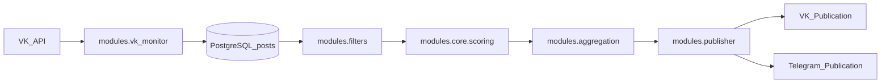
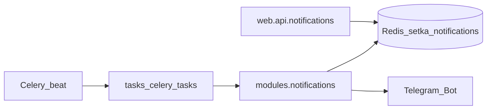
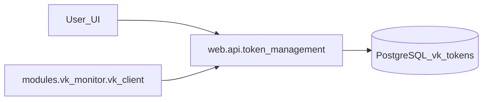

# Архитектура SETKA (overview)

## Компоненты

- **FastAPI**: `main.py` + `web/api/*` + `web/templates/*`
- **PostgreSQL**: хранение регионов/сообществ/постов/токенов/фильтров/расписаний
- **Redis**: кеширование (`utils/cache.py`) + хранение уведомлений (`modules/notifications/storage.py`) + Celery broker/backend (по умолчанию)
- **Celery**: фоновые задачи и расписания `tasks/celery_app.py`
- **Nginx**: reverse-proxy к FastAPI, раздача `/static` (см. `config/setka.conf.editable`)
- **Monitoring**: `/metrics` + `config/prometheus.yml`

## Потоки данных (основные)

### 1) Контент-пайплайн (высокоуровнево)

Где смотреть реализацию:
- `scripts/run_production_workflow.py` (класс `ProductionWorkflow`)
- `tasks/*` (фоновые задачи, расписания см. `tasks/celery_app.py`)

### 2) Уведомления (suggested/messages/comments)

Истина:
- API: `web/api/notifications.py`
- storage: `modules/notifications/storage.py`
- расписание: `tasks/celery_app.py`

### 3) Token management (VK tokens)

## Принцип актуальности

Если “фича есть в доке”, но не подключена в `main.py` и не используется в `tasks/celery_app.py`, это считается **неактуальным**.

