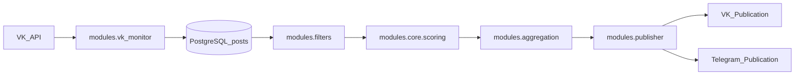
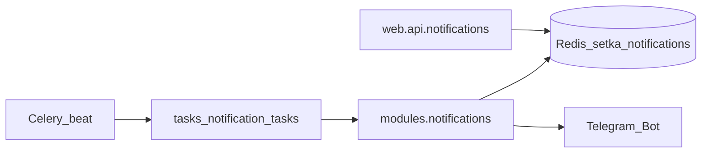

# SETKA: архитектура и пути (актуально)

Если документация расходится с кодом — приоритет у `main.py`, `web/api/*` и `tasks/celery_app.py`.

## 1) Компоненты

- FastAPI: `main.py`, `web/api/*`, `web/templates/*`
- PostgreSQL: `database/models.py`
- Redis: кеш + уведомления + Celery broker/backend
- Celery: задачи и расписания (`tasks/celery_app.py`)
- Nginx: reverse proxy и `/static` (`config/setka.conf.editable`)
- Monitoring: `/metrics` + `config/prometheus.yml`

## 2) Потоки данных (основные)

Контент-пайплайн:

Уведомления:

## 3) Модель данных (кратко)

Источник истины: `database/models.py`.

- `regions`: код, имя, `vk_group_id`, активность, JSON `config`
- `communities`: источники VK, связь с регионом, категория, активность
- `posts`: посты VK, метрики, AI‑поля, статус публикации, fingerprints
- `vk_tokens`: имена токенов и метаданные
- `filters`: фильтры по паттернам, типу, категории
- `publish_schedules`: расписания публикаций

## 4) API (фактические endpoints)

Источник истины: `web/api/*`. Ниже — сводка по префиксам.

### Health (`/api/health`)

- `GET /`
- `GET /full`

### Regions (`/api/regions`)

- CRUD: `GET /`, `GET /{region_code}`, `POST /`, `PUT /{region_id}`, `DELETE /{region_id}`
- Управление активностью: `PATCH /{region_id}/toggle-status`
- Digest template: `GET/PUT /{region_code}/digest-template`, `POST /{region_code}/digest-template/reset`, `POST /{region_code}/digest-template/reset-topic`

### Communities (`/api/communities`)

- CRUD: `GET /`, `POST /`, `PUT /{community_id}`, `DELETE /{community_id}`
- По региону: `GET /region/{region_id}`

### Posts (`/api/posts`)

- `GET /` (список), `GET /{post_id}` (деталь)

### Notifications (`/api/notifications`)

- Списки: `GET /`, `GET /suggested`, `GET /messages`, `GET /comments`
- Управление: `POST /check-now`, `DELETE /`

### Tokens (`/api/tokens`)

- CRUD: `GET /`, `GET /{token_name}`, `POST /add`, `PUT /{token_name}`, `DELETE /{token_name}`
- Валидация: `POST /{token_name}/validate`, `POST /validate-all`

### VK monitoring (`/api/vk`)

- `GET /stats`, `GET /validate-tokens`, `GET /carousel-status`, `POST /optimize-frequency`

### Publisher (`/api/publisher`)

- Статусы: `GET /groups`, `GET /status`
- Публикация: `POST /publish/simple`, `POST /publish/region`, `POST /publish/custom`
- Черновики региона: `GET /regions/{region_code}/posts`

### Parsing (`/api/parsing`)

- `POST /start`
- `GET /status/{job_id}`
- `GET /download/{job_id}`

### Scheduler (`/api/scheduler`)

- `GET /optimal-time/{region_code}`, `GET /engagement-report/{region_code}`
- `GET /should-publish-now/{region_code}`, `GET /calendar/{region_code}`
- `GET /forecast`, `POST /schedule`

### Schedule Management (`/api/schedule`)

- CRUD: `GET /all`, `GET /region/{region_code}`, `POST /add`, `PUT /update/{schedule_id}`, `DELETE /delete/{schedule_id}`
- Генерация: `POST /generate-default`

### Системные/служебные endpoints (укрупнено)

Источники: `web/api/workflow.py`, `system_monitoring.py`, `task_monitoring.py`, `service_notifications.py`, `test_workflow.py`.

- Workflow: статус, запуск цикла, publish, расписание, stats
- System monitoring: stats/operations/regions-status/workflow-status/live/system-status
- Task monitoring: recent/active/scheduled/statistics/overview
- Service notifications: list/status/by-type/clear/types/live
- Test workflow: start/stop/status/scan-region

## 5) UI (страницы)

`/`, `/regions`, `/posts`, `/communities`, `/notifications`, `/tokens`, `/publisher`, `/monitoring`, `/schedule`, `/parsing`
